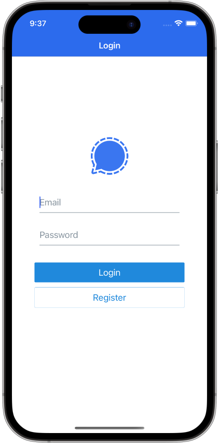
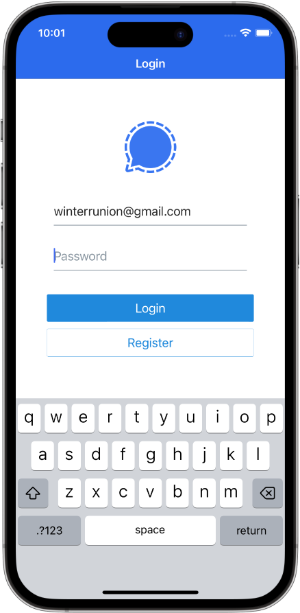
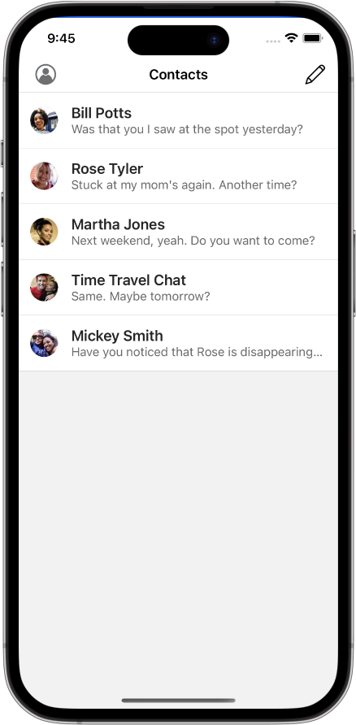
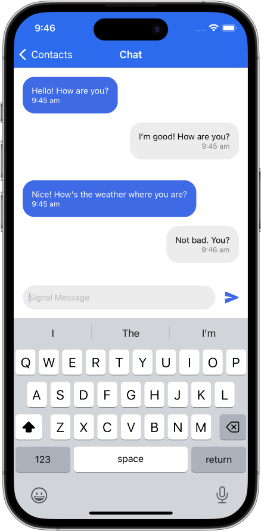

## React Native Signal Clone

A mobile messaging app built in a weekend with React Native, for Experience Haus. 

#### Overview

[Signal](https://signal.org/#signal) is a mobile app that lets users message each other securely, online. To demonstrate competance with React Native, I created my own version of the Signal app. 

It lets you chat in real time with an AI, powered by [BrainShop AI](https://brainshop.ai/).

#### Demo

A development demo via Expo Go is on the way. In the meantime, here are the primary screens:

 

#### Technologies Used: 
- [React](https://reactjs.org/)
  - Version 18.1.0 - latest major release
- [React Native](https://reactnative.dev/)
  -  Version 0.70.5 - latest release candidate
- [Expo SDK](https://docs.expo.dev/)
- [React Native Elements](https://reactnativeelements.com/docs)  (React Native UI toolkit)